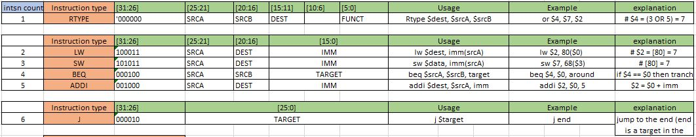

*Author : Tarun Govind Kesavamurthi* |
*School : North Carolina State University - Comp Engg* |
*EMAIL  : tkesava@ncsu.edu*

# Heterogeneous-multicore
I is a pert of my independent study, which is designing a heterogeneous chip-multi-processor RTL. The main objective of this project is to minimize the instruction cycles taken for a thread swap between two cores. The thread swapping technique exploits **3DIC design techniques** to swap the threads faster than the existing techniques. A timing accurate simulator for verifying the RTL core and a working compiler port (LLVM backend) for a RISCV based ISA(supported instns yet to be finalized) to compile the and run the benchmark applications, is also planned for this project.

*-> far in future -> proxy kernel port for the core subsystem (may include a HTIF (host-target interface), which is not planned as of now).*

The project repo focuses on processor designs, starting from a very simple single-cycle processor design.

## Single cycle processor ( Dir: my_single_cycle)
The motivation of this project is to use it as a processor design tutorial. Hence I added a single cycle processor design, which supports a 6 instruction DLX ISA. (**instructions.xls**)

## Classical 5 stage Pipeline processor (Dir: my_s_stage_proc)
* Contains a classical 5 stage integer pipeline processor design for the same 6 instrucation DLX ISA.
* Implements Ex-Ex, MEM-Ex data forwarding.
* RAW data hazard detection is also implemented, which introduces 1 cycle bubble.
* Static branch prediction - predicts the branch is always taken (No predictor implenented), incurs 1 cycle bubble when mis-predicted
* ISA (**instructions.xls**), Documentation (**Classical_5_stage.docs**).
* Floder includes assembler (dir) with a crude assembler written in python and testcases.
* testbench/simulation done by running make, executes **./assembler/bin** instn binary.
* ~~Read my_5_stage_proc/README for more info.~~
* **Look at docs/5_stage_proc.pdf for detailed pipeline diagram**

## Crude Assembler (Dir: assembler)
* contains a simple assembler written in python
* ~~Read assembler/README for more info~~
